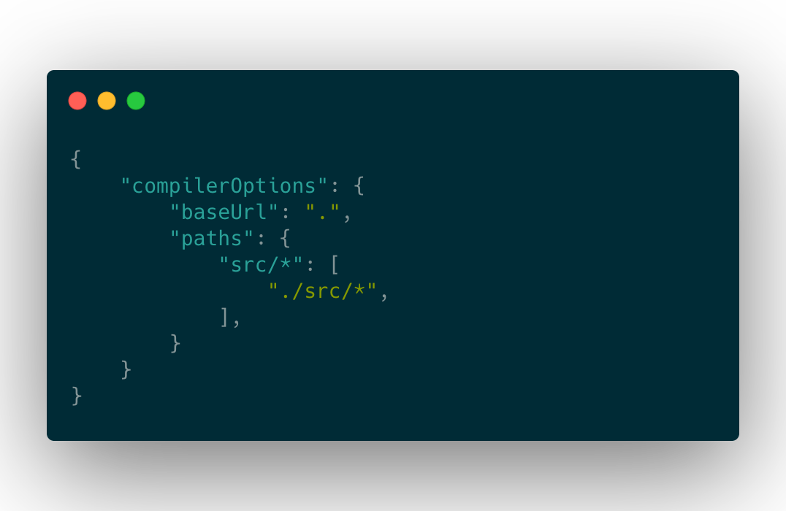

# Use absolute path in TypeScript project

## Why should I use absolute path

相比使用相对路径，绝对路径有以下优点：
1. 更容易书写和更好的可读性
2. 方便代码文件的移动

### 更容易书写和更好的可读性


在使用相对路径的时候，如果要引用的路径和当前文件的位置隔得比较远，写出一个正确的相对路径往往会比较吃力，因为这里面涉及到向上寻找父目录的过程，而绝对路径就没有这个问题，所以写起来心智负担会低很多。

另外，过长的相对路径里往往包含大量的`../..`，看起来就很不美观，而且也不容易明确这个路径的最终位置，可读性比较差。

### 方便代码文件的移动

在项目开发过程中，为了保持工程的整洁，经常会遇到调整目录结构或者移动文件的情况。如果 import 使用的是相对路径的话，一旦移动了该文件的位置，那么这些 import 都需要修改。但是如果使用了绝对路径，就不需要任何的修改就可以移动文件位置。

## Go for it

虽然绝对路径有很多好处，但是它需要多方面的配置才能正常工作。接下来让我们一步步地完成所有的配置工作。

假设现在的项目结构如下。


这里我打算把`src`作为整个项目的起点，所有的绝对路径大概是下面这个样子。

```typescript
import { Button, Slider } from 'src/components';
```

当然你也可以根据实际需求，设置多个绝对路径的起点。

```typescript
import { ButtonA } from 'moduleA/components';
import { ButtonB } from 'moduleB/components';
```

因为引用第三方包的方式也是绝对路径，所以要特别注意，起点目录的名称最好特殊一点，避免和 npm 的某个包名冲突。比如你可以加个符号 `@src`。

确定好目标后，接下来就是配置工具了。具体的配置方法取决你的项目使用了哪些工具，核心诉求就是要让工具能够正确识别并处理绝对路径。

### 配置 tsconfig.json



配置如上图，详细的配置解释可以看[官方文档](https://www.typescriptlang.org/docs/handbook/module-resolution.html#base-url)

配置完成后，当你尝试输入`import {} from 'src/`时，编辑器应该会有 autocompletion 提示完整的路径，那就说明配置成功了。如果没有，尝试重新启动一下编辑器(其实就是重新 ts language server)。

在编辑器里编写 TypeScript 代码时，编辑器会通过 ts language server 来实现智能提示、语法检测等功能。也就是说，配置完 tsconfig 后，只是让编辑器能够正确识别了，但不意味着运行时没问题。实际开发中，项目经常会使用 webpack 这样的 bundler 去加载、编译并运行代码。所以我们仍然需要对它们进行配置。

### 配置 Bundler

下面列举了三个常见的 bundler 的配置方法。

#### Webpack

webpack 可以直接使用[tsconfig-paths-webpack-plugin](https://github.com/dividab/tsconfig-paths-webpack-plugin)这个插件

#### Parcel

Parcel 原生支持这个功能，只要在 package.json 里添加如下内容


详细内容可以参考[官方文档](https://parceljs.org/module_resolution.html)

#### Rollup

可以参考：https://github.com/rollup/plugins/tree/master/packages/alias

### Handle Declaration

如果你的项目是一个 library，需要发布出去给其他人使用的，那你还需要额外处理一下`.d.ts`文件。

因为项目的源码使用的是绝对路径，所以编译以后生成的声明文件(.d.ts)也同样使用了绝对路径。绝对路径能够正常工作是因为我们做了本地化的配置，但是当代码发布后，在用户侧是无法正确处理绝对路径的，因此会出现拿不到类型信息的问题。

所以在生成声明文件的时候，需要将绝对路径再转化成相对路径。我们可以通过[ttypescript](https://github.com/cevek/ttypescript/)来实现这个功能。